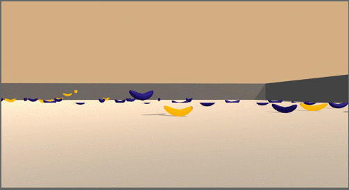

# README

## Project Description

This project presents a deep Reinforcement Learning solution for training an agent to play a video game. The objective of the game is to pick up as many yellow bananas as possible while avoiding blue bananas in a 2-dimensional game field.

## Environment

The banana game runs in a customized environment from [Udacity](https://www.udacity.com) that is based on the Banana Collector environment published by [Unity ML-Agents](https://github.com/Unity-Technologies/ml-agents/blob/master/docs/Learning-Environment-Examples.md#banana-collector) on Github.

The player navigates the environment in a  2-dimensional plane strewn with bananas.

* The action space consists of four choices: forward, backward, left and right.
* The state space contains 37 variables, representing velocity and ray-based perception of objects in front of the agent.
* Landing on a yellow banana yields a reward of 1 point
* Landing on a blue banana results in the loss of 1 point. The objective of the game is to achieve the highest possible score.

For the purposes of this exercise, the task is considered solved when the agent achieves an average score of +13 per episode over 100 consecutive episodes.

## Files

This repository contains the following files:  
* README.md
* Navigation.ipynb - The code for training the agent, written in PyTorch 0.4.0 and Python 3.6.13.
* Report.md - A description of the learning algorithm, hyperparameters and model architecture for the neural network.
* weights.pkl - The saved model weights of the successful agent.

## How to Run

1. Follow the instructions in [Udacity's Deep RL Github repository](https://github.com/udacity/deep-reinforcement-learning#dependencies) to create a virtual environment and install the required dependencies for this project. Activate the virtual environment.

2. Clone this repo into your machine or workspace.

3. Download the Unity environment according to your operating system and place it in the root folder of the repository.

  * [Linux](https://s3-us-west-1.amazonaws.com/udacity-drlnd/P1/Banana/Banana_Linux.zip)
  * [Max OSX](https://s3-us-west-1.amazonaws.com/udacity-drlnd/P1/Banana/Banana.app.zip)
  * [Windows (32-bit)](https://s3-us-west-1.amazonaws.com/udacity-drlnd/P1/Banana/Banana_Windows_x86.zip)
  * [Windows (64-bit)](https://s3-us-west-1.amazonaws.com/udacity-drlnd/P1/Banana/Banana_Windows_x86_64.zip)

4. Run the notebook Navigation.ipynb to train the agent.

The main DQN algorithm, developed in python and composed of QNetwork, Agent and ReplayBuffer classes, is adapted from the solution code provided by Udacity to a previous exercise.  

The algorithm was enhanced through the addition of epsilon-greedy action selection with a decay rate calibrated to decrease the exploration rate from 99% to a minimum of 10% over the course of the training episodes. This approach strongly favors exploration at the beginning of each episode when the environment is unknown and gradually transitions to policy-based action selection as experience grows.

Learning is further enhanced using  prioritized experience replay. Experience replay, which stores a finite set of experiences in a buffer and replays them to improve learning, has been shown to accelerate RL training (**TODO**: add references).

In the banana environment, yellow bananas provide a reward of 1, blue bananas provide a reward of -1, and other steps provide a reward of zero. Due to the sparsity of bananas in the game field, positive and negative rewards are relatively uncommon. In a sample of 300 training episodes, 97.6% of steps received a reward of 0, while only 2.2% received a reward of 1 and 0.2% received a reward of -1.

Narasimhan et al (2015) created separate buffers for experiences with positive (r>0) and non-positive (r<=0)) rewards, and replayed each buffer at different rates. Building on this approach, the current algorithm creates three replay buffers:
* one for positive rewards (r>0)
* one for negative rewards (r<0)
* one for zero rewards (r=0).
