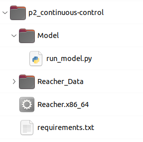

# Project 2 for the Udacity Deep Reinforcement Learning Nanodegree: Continuous Control

This project uses a deep reinforcement learning (RL) algorithm to solve a customized version of the Gym [Reacher](https://www.gymlibrary.ml/environments/mujoco/reacher/) simulation environment. The task in Reacher is to train a double-jointed robotic arm to keep its end effector ("fingertip") close to a constantly moving target in the surrounding 3-dimensional space.

The project demonstrates a deep learning architecture known as [Deep Deterministic Policy Gradients](https://arxiv.org/abs/1509.02971) (DDPG). DDPG is a type of algorithm that extends RL to continuous action spaces. It builds on the [Deep Q-Network (DQN)](https://arxiv.org/abs/1312.5602) approach, which successfully stabilized neural network training on problems with discrete action spaces. 

## Environment

Reacher uses a physics engine called [MuJoCo](https://www.gymlibrary.ml/environments/mujoco/) to simulate the movements of a double-jointed robotic arm. This project uses a version of the environment that simulates 20 agents running simultaneously.

**Reacher Simulation Environment With 20 Agents**

### State Space

At each timestep, the agent receives information about the state of the environment. The **state space consists of 33 variables** containing information about the position, rotation, velocity and angular velocity of the arm. 

### Action Space
Movement is achieved by selecting the torque values (a,b) applied to each of the arm's two hinge joints. Thus, the action space consists of four numbers. Each value can range from -1 to 1.

### The Task

The robot needs to move its arm so that the fingertip stays within the target region. If the robot's fingertip reaches the target region, the agent receives a reward of +0.1 for that timestep.

Each episode receives a score calculated as the average score of the 20 agents. Once the average score over 100 consecutive episodes reaches +30, the environment is considered solved.     

## How to Run

The code is written in python and must be run from the command line.
Following are instructions to set up and run the code in a Linux environment. 

1. Clone the project repository to a suitable machine. A workspace with a GPU is highly recommended. 
2. Create a virtual python environment based on Python 3.9. I strongly recommend using [conda](https://docs.conda.io/en/latest/miniconda.html), because the package requirements contain outdated packages that are not easily accessible using pip.  
    $ conda create -n drlnd
3. Activate the virtual environment and install the required packages.  
    $ conda activate drlnd
    $ conda install requirements.txt
4. Manually install torch version 0.4.1  
    $ conda install torch==0.4.1
5. Download the 20-agent version of the Unity environment provided by Udacity. For example:  
    $ wget https://s3-us-west-1.amazonaws.com/udacity-drlnd/P2/Reacher/Reacher_Linux.zip
6. Unzip the Reacher_Linux archive into a folder one level up in the hierarchy from where run_model.py is located. For example, organize the files in the structure illustrated here:  

7. Run the python script "run_model.py" from the command line to train the model.  
    $ python run_model.py

The results in this repo were produced by training the model on a Dell G15 laptop running Ubuntu 22.04 with an Nvidia GeForce RTX 3060 GPU. Results on other setups may vary.