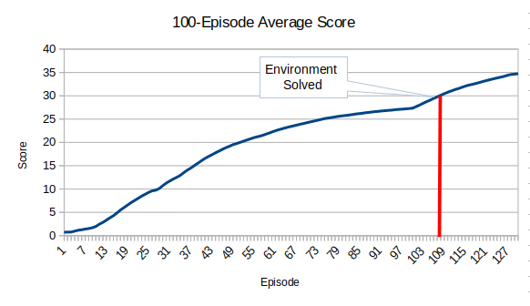
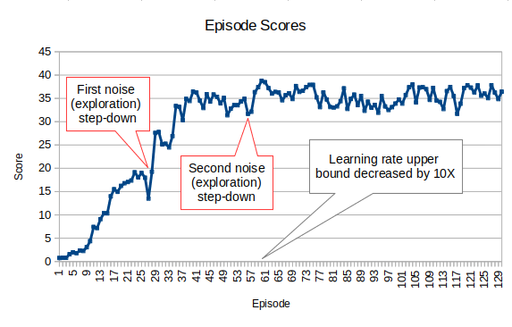
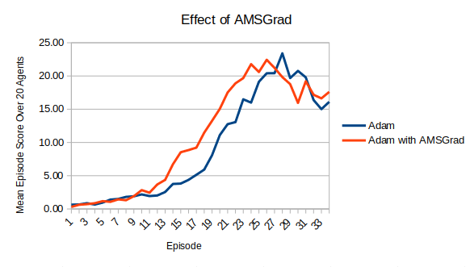

# Report on Project 2: Continuous Control

The Reacher task was solved at episode 108* when the model achieved an average 100-episode score of **30.12**. Each episode score was calculated as the average score over all 20 agents. By episode 130 when training completed, the model achieved a 100-episode average score of 34.73.

A critical step in stabilizing training was the use of scheduled step-downs in the level of exploration. Exploration was injected into the algorithm by adding a noise parameter to the optimal actions predicted by the Actor network. By decreasing the variance of the Ornstein-Uhlenbeck noise-generation process at episodes 28 and 56, algorithm stability increased (see plot below).  

In addition to noise step-down, the upper bound of the learning rate was decreased by a factor of 10 at episode 60. Previous experiments suggested that decreasing the learning rate later in training helped to keep episode-to-episode score oscillation within a tighter band. 

One of the keys to refining model performance was to enable the AMSGrad option when initializing the Adam optimizer. The plot below illustrates how enabling AMSGrad made it possible to achieve a given score level 2-3 episodes earlier.

## Learning Algorithm

This project used a Deep Deterministic Policy Gradients (DDPG) model based on the [DDPG Bipedal reference code](https://github.com/udacity/deep-reinforcement-learning/tree/master/ddpg-bipedal) provided in the [Udacity course repo](https://github.com/udacity/deep-reinforcement-learning). 

DDPG is a deterministic policy-based method that uses an Actor-Critic model to generate the actions for each state visited. 

### Model Architecture
The model architecture consisted of local and target networks for each of the network classes: Actor and Critic. The Actor network took the state variables as inputs and output a predicted best action. The Critic estimated the Q-value of a given (state, action) pair. 

Actor network structure:
* Three Linear layers: input, hidden layer, and output.
* The input layer consisted of 33 nodes to match the dimension of the state space.
* The hidden layer consisted of 200 nodes.
* The output layer consisted of 100 nodes and output four values, corresponding to the size of the action space.
* The first two layers used leaky relu activation functions while the output layer used a hyperbolic tangent activation to ensure that the action values lay within the (-1,1) interval.
* Batch normalization was implemented on the inputs to the second layer (first hidden layer).

Critic network structure:
* Three Linear layers: input, hidden layer, and output.
* The input layer consisted of 33 nodes to match the dimension of the state space.
* The hidden layer consisted of 204 nodes: 200 nodes plus 4 nodes to represent the action space.
* The output layer consisted of 100 nodes and output four values, corresponding to the size of the action space.
* All three layers used leaky relu activation functions.
* Batch normalization was implemented on the inputs to the second layer (first hidden layer).

### Hyperparameters

The hyperparameters tuned during model development are listed in the table below. I added a number of parameters to the standard set in the reference code in order to improve stabilization or performance.
* The variance of the Ornstein-Uhlenbeck noise-generation process, sigma, was a key hyperparameter to tune. This value was initially set to 0.20 and then stepped down at intervals during training. Sigma was reduced to 0.10 at episode 28 and then to 0.05 at episode 56. 
* The Adam optimizer used in training automatically customizes the learning rate for each parameter, within the upper bound given at initialization. I selected an initial learning rate of 0.0007 for the Actor and 0.0003 for the critic. At episode 60, the upper bounds for the learning rates were multiplied by the \<lr_schedule_factor> of 0.1 to refine the learning process.   
* A boolean \<learn> parameter was added to signal which agent results to use for training the Actor network. In order to speed training, all agent experiences were added to the replay buffer but only those whose scores exceeded the median score for that timestep were used in training.

| Parameter | Value | Description                                                     |
|-----------|---|-----------------------------------------------------------------|
|BUFFER_SIZE| int(1e5) | replay buffer size                                              |
| BATCH_SIZE | 32 | minibatch size                                                  |
| GAMMA| 0.99 | rewards discount factor                                         |
| TAU| 0.001 | soft update interpolation parameter for target networks         |
|LR_ACTOR| 0.0007 | upper bound learning rate of the actor                          |
| LR_CRITIC| 0.0003 | upper bound learning rate of the critic                         |
| lr_schedule_episode_1 | 60 | episode designated for first LR scheduled adjustment            |
| lr_schedule_factor | 0.1 | factor for LR scheduled adjustment                              |
| WEIGHT_DECAY | 0 | L2 weight decay                                                 |
|UPDATE_EVERY|20| timesteps between soft update of target networks                |
|learn|True/False| whether to run forward and backward training using agent inputs |
|sigma|episode 0-27: 0.20; episode 28-55: 0.10; episode 56+: 0.05|variance of the Ornstein-Uhlenbeck noise-generation process|
|mu|0.15|mean of the Ornstein-Uhlenbeck noise-generation process|
|fc1_units|200|number of units in first hidden layer|
|fc2_units|100|number of units in second hidden layer|
|n_episodes|130|number of episodes|
|max_t|1000 |maximum timesteps per episode|
|random_seed|543|random seed to ensure reproducibility on a given machine|

## Observations

Solving this environment was far from a straightforward task! My first problem was forgetting to reset the environment between episodes. This contributed to the first 30 or so model runs being abject failures, and used up a lot of my GPU allotment.  

### Reproducibility 
While waiting for Udacity to approve a second tranche of GPU hours, I set up a p2.xlarge instance on AWS to continue training. This led to the discovery that different workspaces can produce very different results in model training. 
* For one particular version of the model, training for 90 episodes on the AWS instance yielded a score of 7.16 compared to only 0.69 when trained in the Udacity workspace. 
* Re-running the same code with the same random seed on my home laptop did yield the exact same results, confirming that reproduceability could at least be ensured on a single machine.

### Future Improvements

One thing that bothered me about the final solution was that the noise and learning-rate step-down points were manually selected by eyeballing the results of previous model runs. The model would be more useful if the logic behind the step-downs could be generalized, so that the inflection points at which step-downs were required could be calculated automatically by the model.

--------------------------------------------------
*_An alternative appoach considers the environment solved at the episode before 100 consecutive episodes averaging >30 points. By this definition the environment was solved at episode 8._