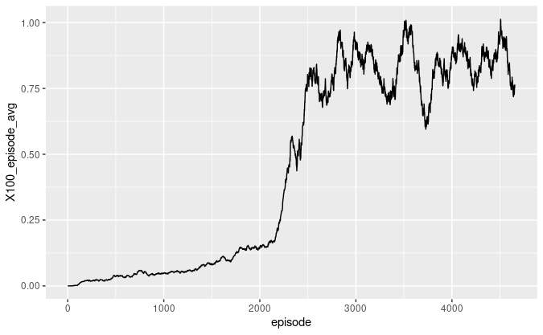
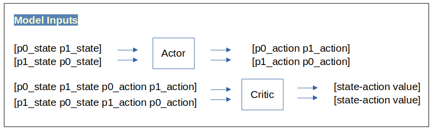

# Report on Project 3: Collaboration and Competition

The Tennis task was solved at episode 2317 when the model achieved an average 100-episode score of **0.511**. The maximum score achieved by the model was 1.013 at episode 4506. Model scores trended upward consistently for the first 2500 episodes, and then oscillated between scores of 0.6 and 1.0 or so.

## Learning Algorithm

The project used a Deep Deterministic Policy Gradient (DDPG) learning algorithm to solve the environment. After many failed attempts using different variations on the DDPG architecture, the approach that succeeded was a simple Actor-Critic model with one shared Actor, one shared Critic, and one shared replay buffer with no experience prioritization.

At each step, two experiences were added to the replay buffer: the experience of each agent with its respective reward. The order of the state and action values were flipped for the second agent, so that the actor and critic networks always received the state and action of the offensive player first and the defensive player second.

## Model Architecture
The model architecture consisted of local and target networks for each of the network classes: Actor and Critic. The Actor network took the state variables as inputs and output a predicted best action for each player. The Critic estimated the Q-value of a given (state, action) pair. 

Actor network structure:  
* Three Linear layers: input, hidden layer, and output.  
* The input layer consisted of 48 nodes to match the dimension of the state vectors for both players.  
* The hidden layer consisted of 256 nodes.  
* The output layer consisted of 128 nodes and output four values, corresponding to actions for both players.  
* The first two layers used leaky relu activation functions while the output layer used a hyperbolic tangent activation to ensure that the action values lay within the (-1,1) interval to which the actions were clipped.  

Critic network structure:  
* Three Linear layers: input, hidden layer, and output.  
* The input layer consisted of 52 nodes to match the dimension of the state + action vectors.  
* The hidden layer consisted of 260 nodes: 256 nodes plus 4 nodes to represent the action space.  
* The output layer consisted of 128 nodes and output one value, corresponding to the size of the action space.  
* The first two layers used leaky relu activation functions.  

## Hyperparameters

Hyperparameter selection was very difficult for this project due to the large number of parameters and the instability of the training process. Given a particular network architecture, there were many combinations of hyperparameter values that completely failed to train the model. It was difficult to determine when the failure was due to the structure of the network or model inputs, and when it was an issue of tuning. I went down many a rabbit hole while trying to solve this environment.

The final successful parameters were as follows:  

| Parameter | Value | Description                                             |
|-----------|---|-------------------------------------------------|
|BUFFER_SIZE| int(1e5) | replay buffer size                                   |
| BATCH_SIZE | 256 | minibatch size                                           |
| GAMMA| 0.9999 | rewards discount factor                                     |
| TAU| 0.06 | soft update interpolation parameter for target networks         |
|LR_ACTOR| 0.001 | upper bound learning rate of the actor                     |
| LR_CRITIC| 0.001 | upper bound learning rate of the critic                  |
| WEIGHT_DECAY | 0 | L2 weight decay                                          |
|UPDATE_EVERY|5| episodes between soft updates|
|LEARN_EVERY|1| timesteps between learning |
|device|"cpu"||
|fc1_units|256|number of units in first hidden layer|
|fc2_units|128|number of units in output layer|
|random_seed|6142|random seed to ensure reproducibility on a given machine|
|MU|0|parameter for OU noise process|
|THETA|0.15|parameter for OU noise process|
|SIGMA|0.2|value of OU noise parameter sigma|
|SCALE|1|scale parameter for OU noise|

## Ideas for Future Work

Future work could focus on reducing the number of episodes needed for training, and reducing the variance in performance after exceeding the +0.5 score threshold. One approach could be to implement Prioritized Experience Replay (PER). I made a number of attempts to implement PER based on the description in [Schaul et al](https://arxiv.org/abs/1511.05952). The authors described using a binary heap to keep the experiences roughly sorted by priority. However, when I implemented the heap data structure the processing times exploded. I identified alternative implementations of prioritization that did not use a heap, and these could be explored to see if performance improves.
